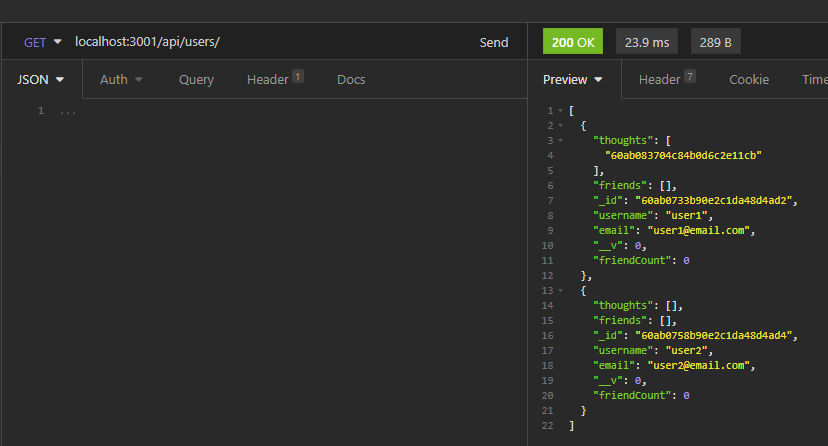
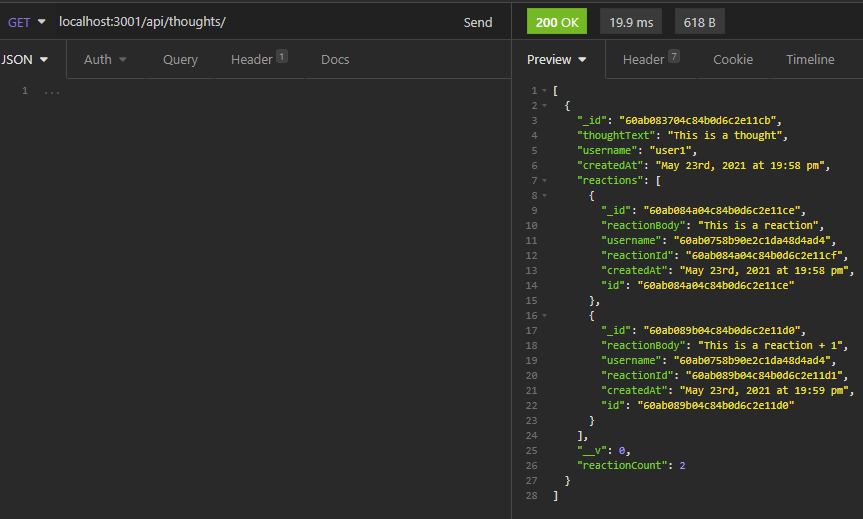

# Social Network API (NoSQL)

## Description
A social networking backend to do the following actions:
Create, update, delete, and view users
Add and remove friends from individual users
Create, update, delete, and view thoughts
Create and delete reactions to thoughts

Note: Reactions are subdocuments of thoughts while users and thoughts are their own documents

## Table of Contents
  * [Installation](#installation)
  * [Usage](#usage)
  * [License](#license)
  * [Contributing](#contributing)
  * [Tests](#tests)
  * [Screenshots](#screenshots)
  * [Questions](#questions)

  ## Installation
  To use this application, you will need MongoDB installed on your computer. Once added, clone the repository, install the dependencies using 'npm -i', run 'npm start' to start the server, and use an API client (i.e. Insomnia) to test the routes found in the attached video

  ## Usage
  Click [here](https://drive.google.com/file/d/1M98uzzovDHLdv_ikQYwhwjt5RYevOut2/view) to open instructional video 1 to see API routes for users, friends, thoughts, and reactions in VS Code
  
  Click [here](https://drive.google.com/file/d/1eVTzUZEm-Smv4pPllKwAhlSmSAL8kKxR/view) to open instructional video 2 to see working API routes for users, friends, thoughts, and reactions in Insomnia
  
  ## License
  No licenses are required for this project

  ## Contributing
  N/A

  ## Tests
  N/A

  ## Screenshots
  GET users example 

  

  GET thoughts example

  

  ## Questions
  If you have any questions, please contact me at [alyssawinn2@gmail.com](mailto:alyssawinn2@gmail.com) or visit my GitHub page [here](https://github.com/alyssawinn/)

